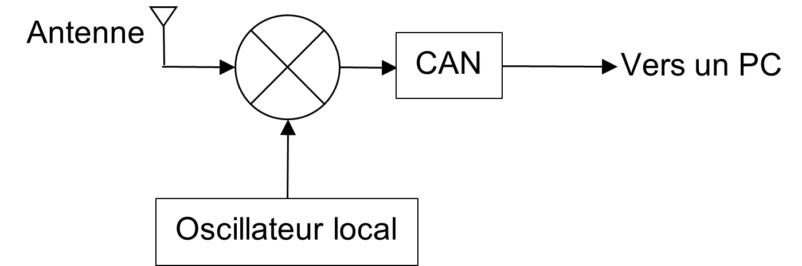
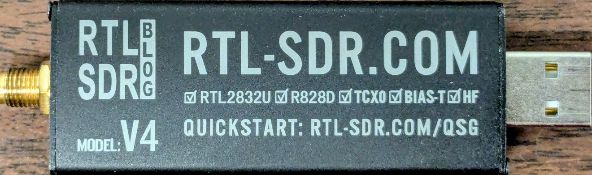
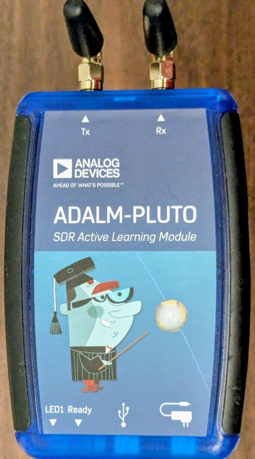

# Radios Logicielles
## Principes de base
Bien que nous puissions utiliser les radios logicielles (SDRs) comme transmetteurs et comme récepteurs, nous détaillerons ici uniquement la fonction de réception, puisque les principes de transmission sont les mêmes, mais inversés. En plus d’autres traitements RF, le matériel physique de la radio logicielle permet d’intégrer ces 2 fonctions principales :
1.	Une transposition fréquentielle en bande de base
2.	Un convertisseur analogique à numérique (CAN)
3.	Une interface avec un PC, souvent sérielle comme USB

Schématiquement, on pourrait résumer le matériel d’une radio logicielle tel qu’illustré au schéma bloc simplifié suivant :

## Caractéristiques d'une radio logicielle
- La possibilité de transmettre
- La plage de fréquences de l’oscillateur local
- La résolution du CAN
- La bande passante du SDR
- La connectique de l’antenne et de sortie vers le PC

En effet, peu de SDRs bons marchés permettent la transmission et les plages de fréquences que peuvent prendre les oscillateurs locaux permettront au minimum de recevoir les bandes HF, VHF et UHF.
Les radios logicielles utilisées dans le cadre de ce cours seront détaillées aux prochaines sections.

## RTL-SDR
Le RTL-SDR V4 (voir le blogue : https://www.rtl-sdr.com/) est une radio logicielle bon marché permettant uniquement la réception. Il s’agit d’une modification de la puce Realtek RTL2832U initialement mise en marché pour les fabricants de récepteurs USB DVB-T. On peut syntoniser une porteuse de 500kHz à 1.766GHz et le CAN a une résolution de 8-bits. La bande passante maximale théorique est de 3.2MHz, mais on recommande de limiter à 2.56MHz.

Pour utiliser le RTL-SDR à la maison, il est nécessaire d’installer le pilote USB Zadig sur le PC (voir le guide https://www.rtl-sdr.com/rtl-sdr-quick-start-guide/). Évidemment, cette étape est déjà faite au laboratoire.

## Pluto SDR
Le Pluto SDR de la compagnie Analog Devices (voir le wiki : https://wiki.analog.com/university/tools/pluto) est une radio logicielle un peu plus évoluée qui permet la transmission et la réception en simultanée. On peut syntoniser ou transmettre à une porteuse de 325MHz à 3.8GHz, mais une modification du firmware permet d’étendre cette fonctionnalité à 70MHz-6GHz (voir https://f1atb.fr/fr/extension-en-frequence-du-pluto-sdr/). Encore une fois, cette manipulation a déjà été faite sur les SDRs du laboratoire. Sa bande passante théorique est de 20MHz, mais nous ne l’utiliserons pas jusqu’à cette largeur en laboratoire, le traitement numérique des signaux étant le principal goulot d’étranglement. Le CAN a une résolution de 12-bits.

## GNUradio
Seul, le SDR a peu d’utilité, il faut utiliser un PC pour le configurer et faire le traitement des échantillons qu’il mesure.
Il existe plusieurs logiciels pour radio-amateurs permettant d’intégrer plusieurs fonctionnalités propres à chaque application. Par exemple, SDR# permet d’écouter les principales modulations analogiques utilisées par les radio-amateurs. SDRangel permet de décoder des transmission analogiques et numériques. Par exemple, il est possible de l’utiliser pour recevoir les transmissions de satellites météo, le décodage des transpondeurs d’aviation (ADS-B) ou nautiques (AIS) ou le décodage de la télé numérique DVB-S.
L’interface logicielle que nous utiliserons dans le cadre de ce cours est GNUradio companion (voir https://www.gnuradio.org/ ou le code source  sur https://github.com/gnuradio/gnuradio).

GNUradio est une librairie python permettant de faire le traitement numérique des échantillons d’un SDR. Au laboratoire, nous avons installé la suite radioconda qui fournit une installation python fonctionnelle comprenant GNU radio et plusieurs autres librairies utiles.
Dans GNUradio companion, chaque compilation d’un schéma-bloc *.grc (traduction libre de flowchart) génère un script python du même nom *.py et c’est ce script qui est exécuté lorsqu’on clique sur le bouton démarrer. Lorsque l’exécution d’un script retourne une erreur, on peut utiliser la fenêtre de dialogue dans le bas de l’écran pour lire le message d’erreur. En plus des blocs fournis à droite de l’interface graphique, il est possible de programmer ses propres blocs.