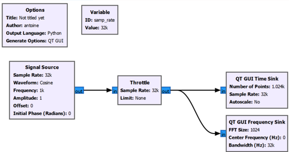

# 🧪 Laboratoire 1
## 🎯 Objectifs
- Se familiariser avec le traitement numérique du signal
- Se familiariser avec l’environnement GNU Radio
- Se familiariser avec le spectre de signaux numérique

## 📻 Partie 1 – Introduction à l’interface GNU Radio
1. Démarrer GNU Radio en cliquant son icône dans la barre de raccourci
2. Créer un nouveau schéma en cliquant l’icône correspondant ou en cliquant File --> New --> QT GUI
3. En créant un nouveau schéma, GNU Radio crée un schéma contenant 2 blocs, ***Options*** et un bloc ***Variable*** (voir capture plus bas). Le bloc ***Options*** permet de donner un nom au schéma, identifier l’auteur, etc. Le bloc ***Variable*** est un bloc que nous pouvons utiliser aussi souvent que voulu afin de contenir des variables qui pourront être utilisées comme paramètres dans d’autres blocs. Dans ce cas-ci, GNU Radio nous a créé une variable samp_rate, puisque nous risquons d’utiliser une fréquence d’échantillonnage unique dans nos autres blocs. Nous verrons plus loin.

4. Ajouter un bloc ***Signal Source*** soi en recherchant avec l’icône  ou en sélectionnant dans l’arborescence de droite Core --> Waveform Generators --> Signal Source. On peut ajouter le bloc en double-cliquant sur le nom ou en faisant un glisser-déposer (drag and drop) dans le schéma. 
5. Ajouter un bloc ***Throttle*** et connecter la sortie du Signal Source à l’entrée du bloc ***Throttle***. On peut connecter 2 blocs soi en cliquant une fois sur les ports connectés ou en cliquant sur un port puis en gardant le bouton gauche enfoncé, on glisse jusqu’au 2e port.
6. Connecter la sortie du bloc ***Throttle*** sur un bloc ***QT GUI Time Sink*** et un bloc ***QT GUI Frequency Sink***. Le schéma devrait être identique à celui-ci :

7. Exécuter le code en cliquant sur le bouton *Play*. Si vous n’aviez pas encore sauvegardé votre schéma, on vous demandera de sélectionner un emplacement et un nom. Une fois le schéma sauvegardé, une fenêtre de graphique apparaîtra. Maximiser la fenêtre si nécessaire afin de bien voir les 2 graphiques. Le premier indique l’amplitude en fonction du temps, un peu comme le ferait un oscilloscope et le 2e l’amplitude en fonction de la fréquence un peu comme le ferait un analyseur de spectre.

:::tip NOTE
GNU Radio Companion, que nous utilisons, est un éditeur graphique d’une librairie python, GNU Radio. Lorsqu’on sauvegarde le schéma, le programme sauvegarde également du code python (*.py) qui sera exécuté lorsqu’on clique sur le bouton *Play*. La barre en haut  nous permet de contrôler le code. Le premier icône nous permet de lire les messages d’erreur si le code ne peut pas être exécuté, le 2e icône permet de compiler le code sans l’exécuter. Le 3e permet de compiler et exécuter le code et le 4e permet d’arrêter l’exécution une fois celle-ci démarrée.
:::

8. Changer le type d’entrée/sortie de tous les blocs pour *float* et observer la différence avec les graphiques précédents. 

:::tip 
En sélectionnant un bloc et en appuyant sur la touche de flèche vers le haut/bas du clavier, on peut changer rapidement le type des entrées/sorties des blocs.
:::

:::info ❓ Question 1
Pourquoi le graphique temporel comprenait 2 signaux lorsque le type des signaux était *Complex*, alors qu’il n’y en a qu’un lorsque le type est *Float*?
:::

9. Dans le bloc ***Signal Source***, réduire la fréquence d’échantillonnage de moitié. On peut changer la valeur : samp_rate pour : samp_rate/2. GNU Radio interprétera la valeur de samp_rate/2.

10. Exécuter le schéma et observer les différences avec les graphiques précédents.

:::info ❓ Question 2
Quel est l’impact de changer la fréquence d’échantillonnage du bloc?
:::

11. Remettre la fréquence d’échantillonnage du bloc ***Signal Source*** à samp_rate et ajouter un bloc ***QT GUI Range*** qui nous permettra de changer la fréquence de la source pendant l’exécution. Spécifier les paramètres suivants :

### Paramètres du bloc QT GUI Range
|Paramètre|Valeur|
|:---:|:---:|
|ID|*freq*|
|Default Value|1e3|
|Start|0|
|Stop|100e3|
|Step|500|

12. Changer également le paramètre Frequency du bloc Signal Source pour freq.
13. Exécuter le schéma et observer le spectre.
14. Augmenter graduellement jusqu’à ce que la raie spectrale semble rebondir. 

:::info ❓ Question 3
Comment se nomme le phénomène que vous observez?
:::

## 📻 Partie 2 – Contenu spectral de séquences définies
1. Créer un nouveau schéma
2. Créer votre propre schéma permettant d’observer le signal temporel et le spectre d’une série de 1,0,1,0,1,0, etc. transmise à 10kbps. Nous utiliserons un taux d’échantillonnage de 100kHz. Vous aurez besoin des blocs ***Vector Source*** pour définir la séquence binaire et ***Repeat*** pour maintenir la valeur de chaque bit pendant toute la période d’un bit. Le schéma résultant devrait ressembler au schéma suivant :

:::info ❓ Question 4
Comment avez-vous calculé la valeur du paramètre Interpolation?
:::

3. Exécuter le programme et valider la durée d’un bit. Corriger le calcul du paramètre Interpolation si nécessaire. Pour aider à utiliser le ***GUI Time Sink*** comme un oscilloscope, il est possible d’activer le *Control Panel* dans l’onglet *Config* du bloc.
4. Une fois la séquence binaire correctement générée, remplir le tableau pour la séquence 10 :

### 📋 Composantes spectrales de la séquence 10
|Composante|Fréquence|Amplitude ou X|
|:---:|:---:|:---:|
|C1|          |          |
|C2|          |          |
|C3|          |          |
|C4|          |          |
|C5|          |          |
|C6|          |          |
|C7|          |          |
|C8|          |          |
|C9|          |          |

5. Changer la séquence pour 1,0,0 et identifier les composantes spectrales présentes ou non :

### 📋 Composantes spectrales de la séquence 100
|Composante|Fréquence|Oui/Non?|
|:---:|:---:|:---:|
|C1|          |          |
|C2|          |          |
|C3|          |          |
|C4|          |          |
|C5|          |          |
|C6|          |          |
|C7|          |          |
|C8|          |          |
|C9|          |          |

6. Changer la séquence pour 1,0,0,0,1 et identifier les composantes spectrales présentes ou non :

### 📋 Composantes spectrales de la séquence 10001
|Composante|Fréquence|Oui/Non?|
|:---:|:---:|:---:|
|C1|          |          |
|C2|          |          |
|C3|          |          |
|C4|          |          |
|C5|          |          |
|C6|          |          |
|C7|          |          |
|C8|          |          |
|C9|          |          |

:::info ❓ Question 5
À partir des spectres précédents, quel lien peut-on établir entre la fréquence binaire, le fréquence des symboles (Baudrate) et le contenu spectral du signal?
:::

## 📻 Partie 3 – Contenu spectral de séquences aléatoires
Les séquences que nous avons obtenues dans la partie précédente sont considérées comme pseudo-aléatoires. Il est possible de générer de telles séquences de n’importe quelle longueur. Plus la longueur est élevée, plus on se rapproche de séquences purement aléatoires, séquences que nous générerons dans cette partie.

1. Remplacer le ***Vector Source*** par un bloc ***Random Uniform Source*** ayant les paramètres suivants :
### 📋 Paramètres du bloc Random Uniform Source
|Paramètre|Valeur|
|:---:|:---:|
|Output Type|int|
|Minimum|0|
|Maximum|2|
|Seed|0|

3. Supprimer le ***QT GUI Time Sink*** et changer la variable *bitrate* par un ***QT GUI Range***. Activer l’option *Config* --> *Control Panel* du bloc ***QT GUI Frequency Sink***.
4. Exécuter le schéma. Changer la valeur du *bitrate* et observer l’effet sur le spectre. Si le spectre n’est pas stable, augmenter le nombre de moyennage en glissant l’option *Avg* du *Control Panel* activé à l’étape précédente.

:::info ❓ Question 6
Quel lien pouvons-nous établir entre le débit binaire et la bande passante du signal?
:::